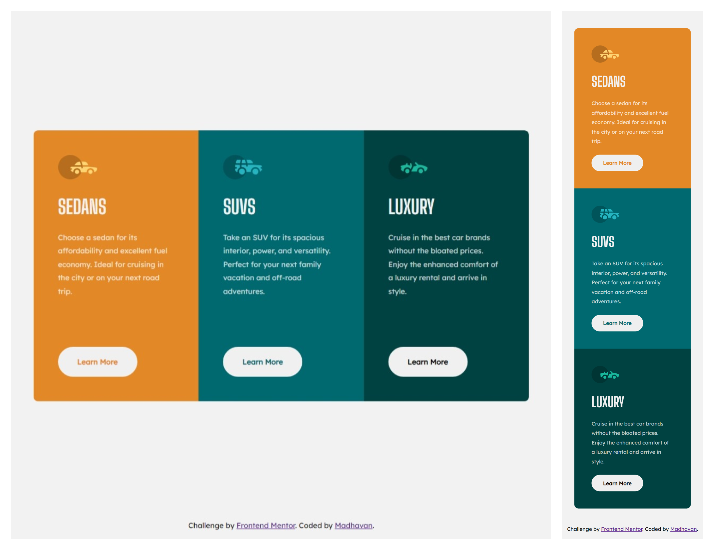

# Frontend Mentor - 3-column preview card component solution

This is a solution to the [3-column preview card component challenge on Frontend Mentor](https://www.frontendmentor.io/challenges/3column-preview-card-component-pH92eAR2-).

## Table of contents

- [Overview](#overview)
  - [The challenge](#the-challenge)
  - [Screenshot](#screenshot)
  - [Links](#links)
- [My process](#my-process)
  - [Built with](#built-with)
  - [What I learned](#what-i-learned)
  - [Useful resources](#useful-resources)
- [Author](#author)

## Overview

### The challenge

Users should be able to:

- View the optimal layout depending on their device's screen size
- See hover states for interactive elements

### Screenshot



### Links

- Solution URL: [Solution URL](https://www.frontendmentor.io/solutions/responsive-3-column-card-component-using-flexbox-QKtM_IL1OB)
- Live Site URL: [Live site URL](https://dulcet-tanuki-ca8717.netlify.app)

## My process

### Built with

- Semantic HTML5 markup
- CSS custom properties
- Flexbox
- Mobile-first workflow

### What I learned

In this 3 column card component I learnt about the `first-child` and `last-child` pesudo selectors

Basically it selects the first or last element of the type you specify. Either it may be a class or a HTML tag

```css
.card:first-child {
  border-radius: 0.7rem 0 0 0.7rem;
}

.card:last-child {
  border-radius: 0 0.7rem 0.7rem 0;
}
```

### Useful resources

- [first-child selector W3 schools](https://www.w3schools.com/cssref/sel_firstchild.php) - This helped me for using the selector and selecting the first card
- [last-child selector W3 schools](https://www.w3schools.com/cssref/sel_lastchild.php) - This helped me for using the selector and selecting the last card
- [MDN Docs - first-child](https://developer.mozilla.org/en-US/docs/Web/CSS/:first-child)
- [MDN Docs - last-child](https://developer.mozilla.org/en-US/docs/Web/CSS/:last-child)

## Author

- Frontend Mentor - [@madhavan-ts](https://www.frontendmentor.io/profile/madhavan-ts)
