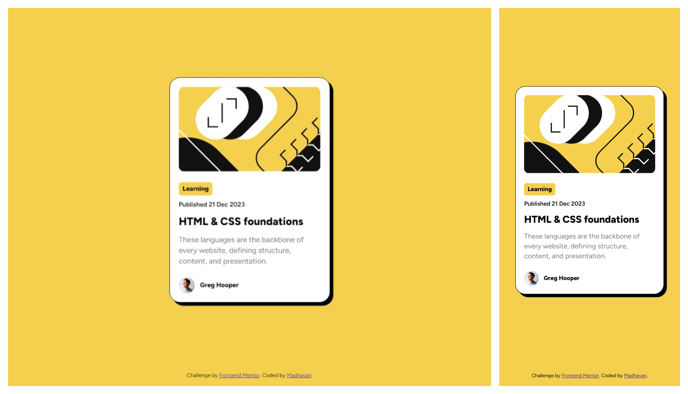

# Frontend Mentor - Blog preview card solution

This is a solution to the [Blog preview card challenge on Frontend Mentor](https://www.frontendmentor.io/challenges/blog-preview-card-ckPaj01IcS). Frontend Mentor challenges help you improve your coding skills by building realistic projects.

## Table of contents

- [Overview](#overview)
  - [The challenge](#the-challenge)
  - [Screenshot](#screenshot)
  - [Links](#links)
- [My process](#my-process)
  - [Built with](#built-with)
  - [What I learned](#what-i-learned)
  - [Useful resources](#useful-resources)
- [Author](#author)

## Overview

### The challenge

Users should be able to:

- See hover and focus states for all interactive elements on the page

### Screenshot



### Links

- Solution URL: [Solution URL](https://www.frontendmentor.io/solutions/blog-preview-card-with-focus-and-hover-states--BfDrqaywR)
- Live Site URL: [Live site URL](https://rainbow-rugelach-52872f.netlify.app)

## My process

### Built with

- Semantic HTML5 markup
- CSS custom properties
- Flexbox
- Mobile-first workflow

### What I learned

The use of **:has()** pesudo selector in CSS. This selector is used to select the parent element that is containing the particular element

To see how you can add code snippets, see below:

```css
:has(.card__link:focus) {
  box-shadow: 1.6rem 1.6rem var(--black);
}
```

### Useful resources

- [MDN Docs](https://developer.mozilla.org/en-US/docs/Web/CSS/:has) - This helped me for **:has()** pseudo-selector

## Author

- Frontend Mentor - [@madhavan-ts](https://www.frontendmentor.io/profile/madhavan-ts)
