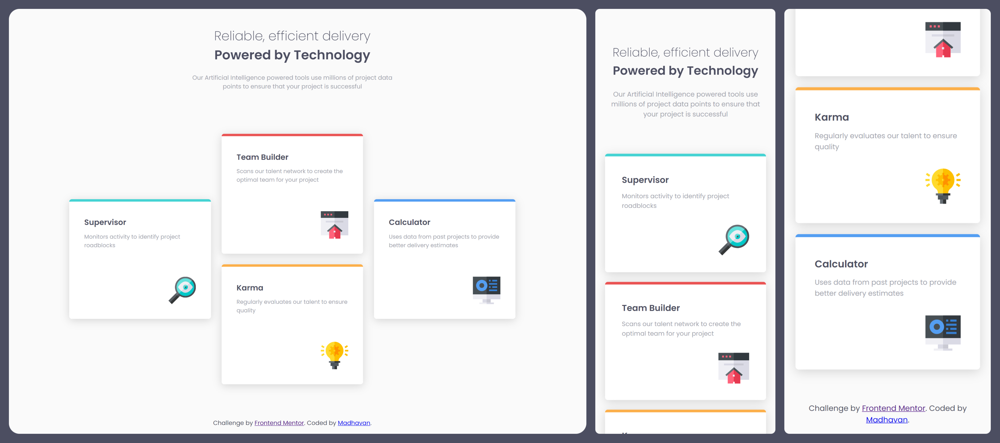

# Frontend Mentor - Four card feature section solution

This is a solution to the [Four card feature section challenge on Frontend Mentor](https://www.frontendmentor.io/challenges/four-card-feature-section-weK1eFYK).

## Table of contents

- [Overview](#overview)
  - [The challenge](#the-challenge)
  - [Screenshot](#screenshot)
  - [Links](#links)
- [My process](#my-process)
  - [Built with](#built-with)
  - [What I learned](#what-i-learned)
- [Author](#author)

## Overview

### The challenge

Users should be able to:

- View the optimal layout for the site depending on their device's screen size

### Screenshot




### Links

- Solution URL: [Solution URL](https://your-solution-url.com)
- Live Site URL: [Live site URL](https://your-live-site-url.com)

## My process

### Built with

- Semantic HTML5 markup
- CSS custom properties
- Flexbox
- CSS Grid
- Mobile-first workflow


### What I learned
I used the **grid layout** and used the ```grid-rows``` and ```grid-columns``` properties to **align the card** . This has helped me a lot. 

```css
.products {
  display: grid;
  grid-gap: 2.5rem;
  grid-template-rows: repeat(4, minmax(max-content, 1fr));
  grid-template-columns: repeat(3, 2fr);
}

.products__card--indigo {
  grid-row: 2 / span 2;
  grid-row-start: 2;
}

.products__card--red {
  grid-row: 1 / span 2;
  grid-column: 2;
}

.products__card--yellow {
  grid-row: 3 / span 2;
  grid-column: 2;
}

.products__card--blue {
  grid-row: 2 / span 2;
}
```

## Author

- Frontend Mentor - [@madhavan-ts](https://www.frontendmentor.io/profile/madhavan-ts)
