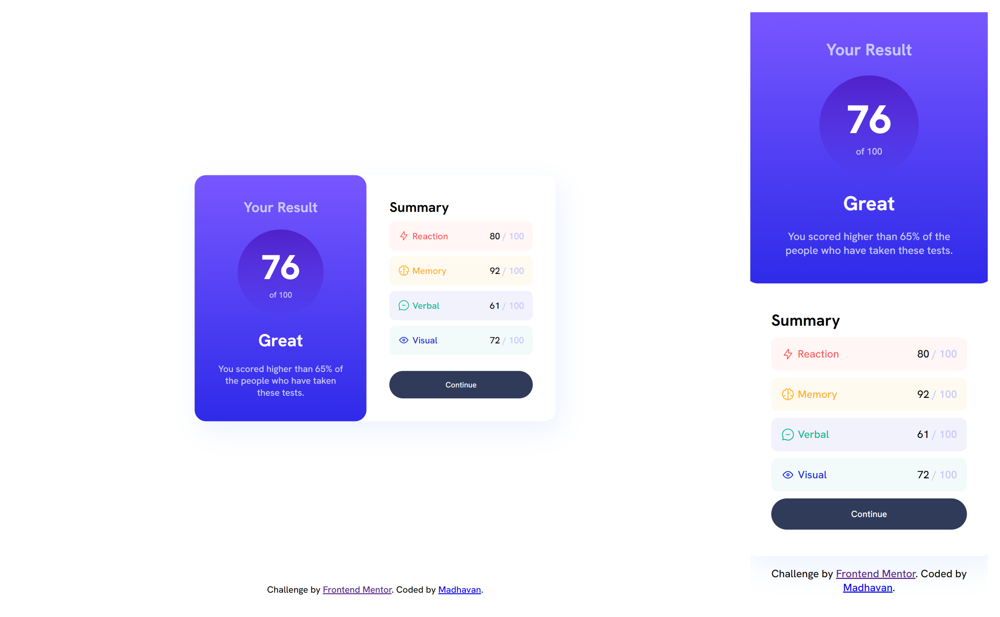

# Frontend Mentor - Results summary component solution

This is a solution to the [Results summary component challenge on Frontend Mentor](https://www.frontendmentor.io/challenges/results-summary-component-CE_K6s0maV). 

## Table of contents

- [Overview](#overview)
  - [The challenge](#the-challenge)
  - [Screenshot](#screenshot)
  - [Links](#links)
- [My process](#my-process)
  - [Built with](#built-with)
  - [What I learned](#what-i-learned)
  - [Useful resources](#useful-resources)
- [Author](#author)

## Overview

### The challenge

Users should be able to:

- View the optimal layout for the interface depending on their device's screen size
- See hover and focus states for all interactive elements on the page
- **Bonus**: Use the local JSON data to dynamically populate the content

### Screenshot




### Links

- Solution URL: [Solution URL](https://your-solution-url.com)
- Live Site URL: [Live site URL](https://fancy-dasik-0d72aa.netlify.app/Results%20summary%20component/)

## My process

### Built with

- Semantic HTML5 markup
- CSS custom properties
- Flexbox
- CSS Grid
- Mobile-first workflow

### What I learned

I have learned to import the **JSON** data and used it to create the elements dynamically

For used the data from **JSON**  we need to fetch the data. 

```css
.proud-of-this-css {
  color: papayawhip;
}
```
```js
async function fetchData() {
  try {
    const response = await fetch('./data.json');
    const data = await response.json();

    console.log(data);

    for (let index = 0; index < data.length; index++) {
      addElement(data[index]);
    }
  } catch (error) {
    console.error('Error fetching data:', error);
  }
}
```

To Dynamically add the elements we can create the nodes using the ```document.createElement()``` function and to add the class ```element.classList.add()``` function.

To make it as a child we use the ```parent.appendChild(child)```

```js
<!-- parent -->
let card = document.createElement("div");
card.classList.add("card__topic", obj.color);

<!-- child -->
let img = document.createElement("img");
img.src = obj.icon;

<!-- to append -->
card.appendChild(img);
```

To Insert the element before the element. I used the ```parent.insertBefore(element, [element before which it should be inserted])```

```js
summary.insertBefore(card, btn);
```

## Author

- Frontend Mentor - [@madhavan-ts](https://www.frontendmentor.io/profile/madhavan-ts)