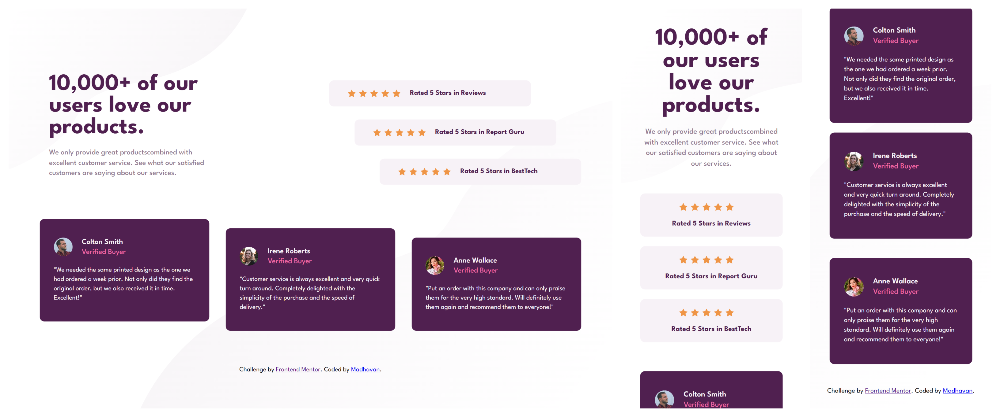

# Frontend Mentor - Social proof section solution

This is a solution to the [Social proof section challenge on Frontend Mentor](https://www.frontendmentor.io/challenges/social-proof-section-6e0qTv_bA). 
## Table of contents

- [Overview](#overview)
  - [The challenge](#the-challenge)
  - [Screenshot](#screenshot)
  - [Links](#links)
- [My process](#my-process)
  - [Built with](#built-with)
  - [What I learned](#what-i-learned)
  - [Useful resources](#useful-resources)
- [Author](#author)


## Overview

### The challenge

Users should be able to:

- View the optimal layout for the section depending on their device's screen size

### Screenshot




### Links

- Solution URL: [Solution URL](https://www.frontendmentor.io/solutions/fully-responsive-social-proof-section-using-grid-and-flex-tKMmQwMblP)
- Live Site URL: [Live site URL](https://adorable-rabanadas-7d234a.netlify.app/)

## My process

### Built with

- Semantic HTML5 markup
- CSS custom properties
- Flexbox
- CSS Grid
- Mobile-first workflow


### What I learned

I have learned some grid properties and made use of ```auto-fit```, ```min-content```, ```max-content``` values in grid. I have came across the ```:nth-of-type()``` pseudo selector and also used it.

Learned to make the page more responsive using the multiple breakpoints when the page breaks

```css
.reviews {
  grid-column: 1/-1;
  display: grid;
  gap: 3.5rem;
  grid-template-columns: repeat(auto-fit, minmax(30rem, 1fr));
  padding: 2rem 4rem;
}

.review__card:nth-of-type(2){
  margin-top: 2rem;
} 
```

### Useful resources

- [:nth-of-type() selector - W3Schools](https://www.w3schools.com/cssref/sel_nth-of-type.php#:~:text=The%20%3Anth%2Dof%2Dtype(n)%20selector%20matches,of%20type%2C%20of%20its%20parent.) - This helped me for using the selector and applying margin to the cards
- [Using n in nth-of-type](https://developer.mozilla.org/en-US/docs/Web/CSS/:nth-of-type) - I learned that we can use ```nth-of-type()``` selector with value **n**.


## Author

- Frontend Mentor - [@madhavan-ts](https://www.frontendmentor.io/profile/madhavan-ts)